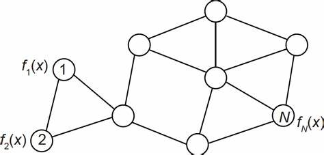

---
categories:
- decentralized
date: "2022-11-27"
draft: false
excerpt: 'SQP-based algorithm with stochastic constraints, developed for decentralized problems.'
slug: decentralized-Albert
subtitle: |
    On-going project.
tags:
- 2022
- Albert
- decentralized
- SQP
- optimization
title: 'Partial constrained method'
weight: 2
---

Without rigorous definition, I want to give you a general description and intuition on what are we doing.
## Introduction
**First, let's consider a decentralized setting**:

    
     
    
Connected graph

In total, we have \\(N\\) nodes; each node has \\(p\\) dimensions and distinct objective function \\(f_i\\). Each node can only use the information 
of its own and the nodes connected to it. For example, thinking of these nodes as computers, then the connected nodes represent the computers that are close to each other 
in real-world distance.

Then, how to find a real-world problem using this setting?

Consider the situation that we are evaluating a loss function with many local data in different computers. The privacy or communication cost requires each computer to evaluate different 
loss functions, by only getting access to limited information from their "neighbors". That's where the setting comes into play.

**The problem that we want to solve is**:
$$
\begin{align}
    \min_{x_i\in \mathbb{R}^p} \quad &\sum_{i = 1}^{N} f_i(x_i) \\\\
    \textbf{s.t.} \quad& x_i = [\mathbf{Zx}]_i, \qquad i = 1, \ldots, N  \tag{1}\label{1}
\end{align}
$$
where \\(\mathbf{Zx} = \mathbf{Z}\cdot\begin{pmatrix}x_1 \\\\ \vdots \\\\x_N \end{pmatrix} \in \mathbb{R}^{np}\\) is consensus average for each node (can be understood as the weighted average of connected nodes). And, \\([\mathbf{Zx}]_i\\) is the corresponding dimensions w.r.t. different nodes, \\(x_i\\). 

However, this kind of constraints will make SQP (Sequential 
Quadratic Programming) method move inside the polyhedron formed by each nodes' initial points. What's more, in this formulation, we can only move in the consensus average sense, which 
only give us bad results and make SQP method useless here.

**With the above thoughts, we change the formulation with a approximation of the constraints.** What we are doing now is, relaxing the constraints into a stochastic version which 
can make SQP method work; and seek a good convergence performance with this Newton-like method. 

In our project, we are developing a SQP-based algorithm with our last formulation. That is, **partial constraint method**.

## Additional information:

Actually the original problem, for this decentralized setting, is:
\begin{align}
    \min_{x\in \mathbb{R}^p} \quad &\sum_{i = 1}^{N} f_i(x) \tag{2}\label{object}
\end{align}

Some important things should be noticed:
- Each node can only update its iterates with its own and connected nodes' information.
- The problem (\ref{object}) is requiring all the nodes to have the same iterates, \\(x\\).

We cannot directly solve this problem without translating it into constrained problem, i.e.: 

\begin{align}
    \min_{x_i\in \mathbb{R}^p} \quad &\sum_{i = 1}^{N} f_i(x_i) \\\\
    \textbf{s.t.} \quad& x_i = x_j, \quad \forall i,j \in \mathcal{N}_i
\end{align}

This reformulation is equivalent to[^1]:
\begin{align}
        \min_{x_i\in \mathbb{R}^p} \quad &f(\mathbf{x}) = \sum_{i = 1}^{n} f_i(x_i)\\\\
        \textbf{s.t.} \quad& \mathbf{x} = \mathbf{Zx}   
\end{align}

[^1]:[A. Nedic and A. Ozdaglar, "Distributed Subgradient Methods for Multi-Agent Optimization," in IEEE Transactions on Automatic Control, vol. 54, no. 1, pp. 48-61, Jan. 2009, doi: 10.1109/TAC.2008.2009515.](https://ieeexplore.ieee.org/document/4749425)
