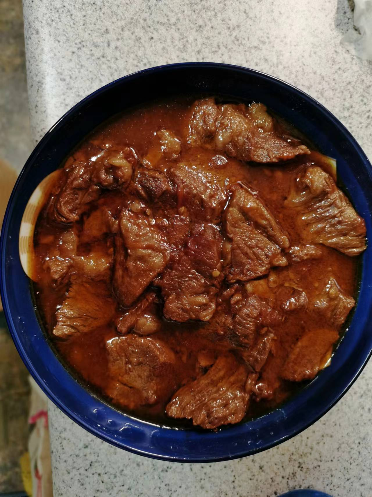

---
categories:
- 炖煮
date: "2018-01-01"
draft: false
excerpt: '咕嘟咕嘟'
slug: normal
subtitle: 
tags:
- recipe
title: '炖菜'
weight: -1
show_comments: true
---

## W

### 王氏炖牛肉

 注意：此处肉量以3磅/1.36公斤/2.72斤肉为标准，请根据肉量多少按比例增减各项用料。 

食材及香料：
- 肉：牛肩（chunk roast）/牛肋条/牛胸口 
- 香料：
    1. 葱姜适量（大概3-4棵小葱；姜大小不好规定，你看着来）
    2. 完整八角（或称大料）1-2颗
    3. 桂皮一个（我买过的桂皮都是一卷一卷或一片一片的，长度大概在1.5-2个银行卡）
    4. 香叶6-10片（我买的半个银行卡大小的香叶，大一点的就少放点）
    5. （白蔻3个，我不知道有什么用，但是会放）
    6. （花椒10粒，因为买多了，所以我焯水会放，但应该没什么大用）
    7. （干辣椒一个，无所谓）
- 其他：冰糖、料酒/花雕酒
- 风味料：
    - 番茄/蕃茄膏/罐头番茄（我一般放俩大番茄，因为我爱吃小酸甜的口儿）
    - 酱油/生抽

步骤：
- 焯水：
  
  别把肉切太小（牛肉会缩水，我一般是半个多中指长宽的块）。冷水下锅（差不多没过肉就行），加热时放入一半的葱姜，加料酒/花雕酒（和花椒）。开锅后大概5分钟，关火捞出肉，期间不要忘记撇去浮沫，肉汤不要丢弃。
- 煎炒牛肉和香料：（下番茄前中火，下番茄后大火）

  稍微控一下肉中的水，下锅煎/煸炒一下，稍微上点色就放余下所有香料一起炒一炒。香味出来了，大料舒展开了，下酱油（大概3、4勺）炒一下，10秒左右就能出香味，这时候下番茄煸出汤。
- 炖煮：
  
  加入刚才焯水后的肉汤直至差不多没过牛肉，大火开锅后下冰糖（大概10-20小粒这样？放心吧不会甜的）。一般这个时候我还会加点酱油，看你感觉。之后盖盖儿，开小火炖煮1-1.5小时（牛肩肉比较好烂，其他部位自己把握），其间一定记得多来看看你的肉，汤少了就补上你没用完的肉汤或水。
- 收汤：
  
  炖够了上述时间，开盖大火收汤。这个阶段多拿勺尝尝汤的咸淡，不够咸就加盐（比你平时吃菜口咸一点），但切记汤浓了之后口儿会变重。收到比芝麻糊稀一点的汤就行（稍微有点挂勺）。好了，大功告成！！

这个肉烩胡萝卜、土豆、洋葱、卷心菜或者弄个面条，再或者直接拌饭都是不错的。

 想吃其他风味的就改一下风味料，例如，想多一点酱香就加点甜面酱啥的；不想要小酸甜那就只放酱油什么的；清炖当然也可以，。总之，做饭请务必随心所欲。 

